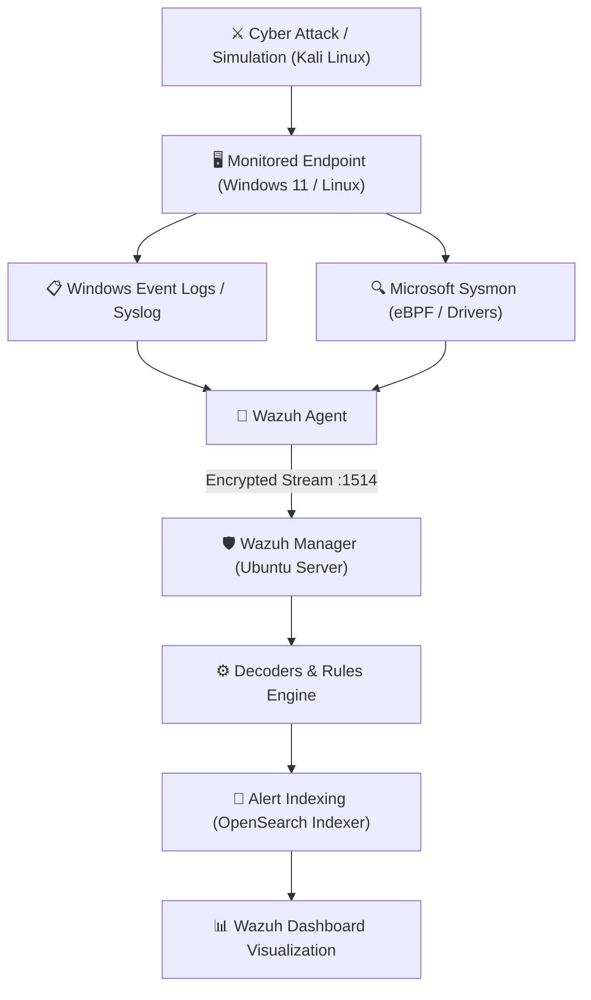

# 🛡️ Design and Implementation of a Wazuh-Based SOC Home Lab for Attack Detection and Log Analysis


---

## 📖 Project Overview

This project demonstrates the design and implementation of a Security Operations Center (SOC) Home Lab using the **Wazuh SIEM platform**. The lab simulates real-world cyberattacks and security monitoring in a controlled virtual environment.

The environment consists of:

- 🖥️ Ubuntu Server running Wazuh Manager
- 💻 Windows 11 Endpoint with Sysmon and Wazuh Agent
- 🐉 Kali Linux Attacker Machine

The objective is to detect malicious activities, collect security events, analyze logs, and generate alerts through the Wazuh Dashboard.


---

# 🎯 Objectives

- Deploy a complete Wazuh SIEM environment
- Monitor Windows endpoint activity
- Detect network reconnaissance
- Detect brute-force attacks
- Detect suspicious PowerShell execution
- Collect Sysmon telemetry
- Create a professional SOC Home Lab
- Document the entire deployment process

---

# 🏗️ Lab Architecture

```
                   Internet
                        │
                VirtualBox NAT Network
                        │
      ┌─────────────────┼─────────────────┐
      │                 │                 │
      │                 │                 │
 Ubuntu Server      Windows 11        Kali Linux
(Wazuh Server)      (Victim)          (Attacker)
      │                 │                 │
      │                 │                 │
      └──────────── Wazuh Agent ──────────┘
                    Security Logs
                         │
                  Wazuh Manager
                         │
                Wazuh Dashboard
```

---

# 💻 Virtual Machines

| Machine | Operating System | Purpose |
|----------|------------------|---------|
| Wazuh Server | Ubuntu Server 24.04 LTS | SIEM Platform |
| Windows Endpoint | Windows 11 Pro | Victim Machine |
| Attacker | Kali Linux | Attack Simulation |

---

# 🛠 Technologies Used

## Operating Systems

- Ubuntu Server 24.04 LTS
- Windows 11 Pro
- Kali Linux

## Security Tools

- Wazuh
- Sysmon
- Windows Event Logs
- Filebeat
- OpenSearch
- Wazuh Dashboard

## Offensive Security

- Nmap
- Hydra
- Netcat
- Metasploit
- CrackMapExec (Optional)

## Networking

- VirtualBox
- NAT Network

---

# 📂 Repository Structure

```
.
├── README.md
├── LICENSE
├── .gitignore
├── docs/
├── configs/
├── detection/
├── kali/
├── ubuntu/
├── windows11/
├── wazuh/
├── screenshots/
└── reports/
```

---

# 📚 Documentation

| Document | Description |
|:---|:---|
| [docs/Architecture.md](docs/Architecture.md) | Lab architecture and virtual network topology |
| [docs/Ubuntu-Installation.md](docs/Ubuntu-Installation.md) | Ubuntu Server 24.04 LTS deployment |
| [docs/Wazuh-Installation.md](docs/Wazuh-Installation.md) | Complete Wazuh SIEM platform installation |
| [docs/Windows11-Agent.md](docs/Windows11-Agent.md) | Windows 11 Wazuh Agent deployment |
| [docs/Sysmon-Configuration-Windows.md](docs/Sysmon-Configuration-Windows.md) | Microsoft Sysmon deployment on Windows 11 |
| [docs/Sysmon-Configuration-Linux.md](docs/Sysmon-Configuration-Linux.md) | Microsoft Sysmon for Linux (`sysmonforlinux`) eBPF telemetry |
| [docs/Kali-Attack-Simulation.md](docs/Kali-Attack-Simulation.md) | Offensive security attack simulations |
| [docs/Detection-Rules.md](docs/Detection-Rules.md) | Built-in and custom detection rules |
| [docs/Troubleshooting.md](docs/Troubleshooting.md) | SOC lab deployment troubleshooting |
| [docs/WAZUH_COMMAND_REFERENCE.md](docs/WAZUH_COMMAND_REFERENCE.md) | Complete Wazuh command cheatsheet |

---

# 🔥 Attack Simulations

The following attack scenarios and tactics were simulated and detected in this lab:

- **Network Reconnaissance & Port Scanning** (Nmap TCP Syn / Service / Aggressive scans)
- **Authentication & Brute Force** (Hydra RDP/SSH & Windows Event 4625 failed logons)
- **Suspicious Process Execution** (PowerShell, `curl`, `netcat`, and suspicious binaries)
- **Advanced Endpoint Telemetry** (Sysmon Process Creation `EventID 1`, Network Connect `EventID 3`, Process Terminate `EventID 5`)
- **Persistence & Configuration Changes** (Windows Registry modifications & Linux `/etc/` file changes)
- **File Integrity Monitoring (FIM)** (Real-time file creation and tampering detection)

---

# 📊 Detection Workflow



---

# 📸 Key Visual Evidence & Dashboards


*Centralized Wazuh Dashboard home interface presenting aggregate security alerts.*


*Multi-platform active endpoint monitoring in Wazuh Dashboard.*


*Live endpoint telemetry and Sysmon process events indexed in Wazuh.*

> Complete screenshot gallery available in **[screenshots/README.md](screenshots/README.md)**.

---

# 🚀 Installation Guide

Step-by-step installation instructions are available in:
- **[Wazuh Installation Guide](docs/Wazuh-Installation.md)**
- **[Windows 11 Agent Guide](docs/Windows11-Agent.md)**
- **[Sysmon Windows Guide](docs/Sysmon-Configuration-Windows.md)**
- **[Sysmon Linux Guide](docs/Sysmon-Configuration-Linux.md)**

---

# 📑 Project Report

The complete academic project report is available in:
- **[`reports/Final_Report.pdf`](reports/Final_Report.pdf)**
- **[Report Summary Documentation](reports/README.md)**

---

# 📚 References

- [Project Video Demonstration on YouTube](https://youtu.be/duEibRGYMHo?si=kfcGcQ_OzSiN8hRz)

---

# 👨‍💻 Author

**Natto Muni Chakma**

B.Tech Computer Science and Engineering

Andhra University College of Engineering

Specialization:
- Cybersecurity
- Security Operations Center (SOC)
- Threat Detection
- Digital Forensics

GitHub:
https://github.com/NATTOMR

---

# ⭐ Future Improvements

- Integrate Suricata IDS
- Integrate VirusTotal API
- YARA Rule Detection
- Sigma Rule Integration
- MITRE ATT&CK Mapping
- TheHive Integration
- Shuffle SOAR Automation

---

# 📜 License

This project is licensed under the MIT License.