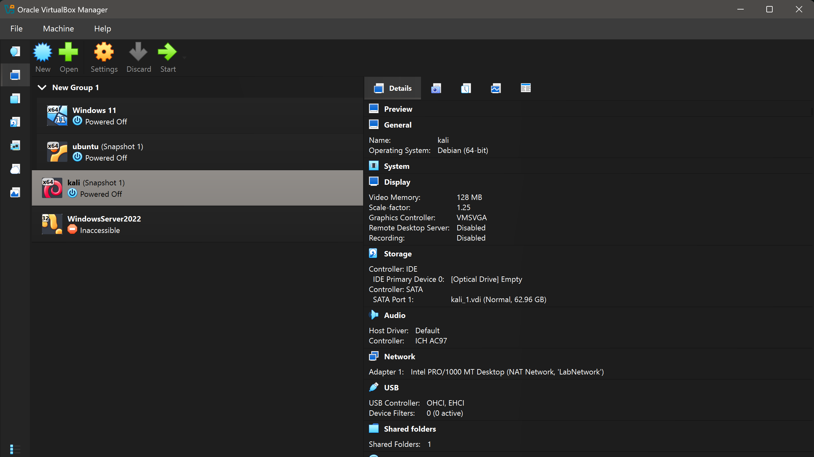
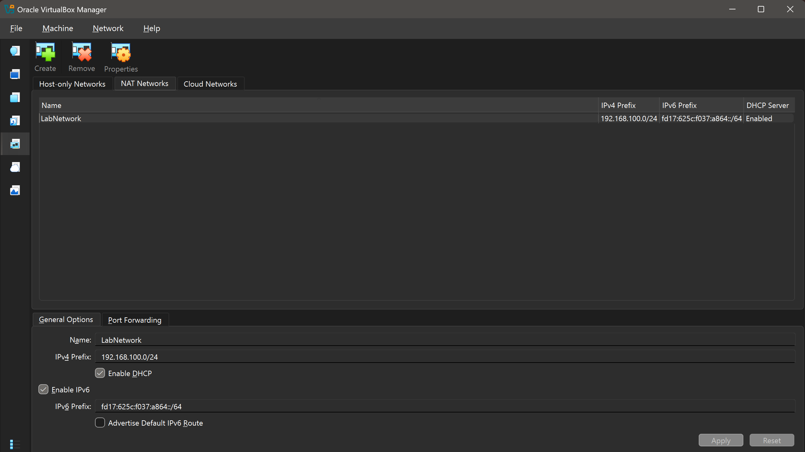

# Lab Architecture

This document describes the architecture of the Wazuh-based Security Operations Center (SOC) Home Lab used for attack detection and log analysis.

---

# Overview

The lab is designed to simulate a small enterprise network where security events generated by a Windows endpoint are collected, analyzed, and visualized using the Wazuh SIEM platform.

Three virtual machines are deployed using Oracle VirtualBox:

- Ubuntu Server (Wazuh Server)
- Windows 11 (Victim Endpoint)
- Kali Linux (Attacker)

---

# Architecture Diagram

```
                         Host Computer
                   Windows 11 + VirtualBox
                              │
                ───────── NAT Network ─────────
                              │
        ┌─────────────────────┼─────────────────────┐
        │                     │                     │
        │                     │                     │
┌────────────────┐   ┌────────────────┐   ┌────────────────┐
│ Ubuntu Server  │   │  Windows 11    │   │  Kali Linux    │
│                │   │                │   │                │
│ Wazuh Manager  │   │ Wazuh Agent    │   │ Attack Machine │
│ Dashboard      │   │ Sysmon         │   │ Nmap           │
│ Indexer        │   │ Event Logs     │   │ Hydra          │
└────────────────┘   └────────────────┘   └────────────────┘
        ▲                     │
        │                     │
        └──────────── Security Logs ──────────────┘
                              │
                    Detection & Analysis
                              │
                    Wazuh Dashboard Alerts
```

---

# Components

## 1. Wazuh Server

Operating System

Ubuntu Server 24.04 LTS

Responsibilities

- Collect logs
- Analyze security events
- Generate alerts
- Store indexed data
- Provide web dashboard

Installed Components

- Wazuh Manager
- Wazuh Dashboard
- Wazuh Indexer

---

## 2. Windows 11 Endpoint

Purpose

Acts as the monitored workstation.

Installed Software

- Wazuh Agent
- Sysmon

Collected Logs

- Windows Security Logs
- PowerShell Logs
- Process Creation
- Registry Events
- Service Installation
- File Events

---

## 3. Kali Linux

Purpose

Simulates attacker activities.

Tools Used

- Nmap
- Hydra
- Netcat
- Metasploit Framework

Example Activities

- Port Scanning
- Password Attacks
- Network Enumeration

---

# Data Flow

```
Attack
   │
   ▼
Windows Event Logs
   │
Sysmon
   │
Wazuh Agent
   │
Secure Communication
   │
Wazuh Manager
   │
Rules Engine
   │
Alert Generation
   │
Indexer
   │
Dashboard
```

---

# Communication Flow

| Source | Destination | Protocol |
|---------|-------------|----------|
| Windows Agent | Wazuh Manager | TCP 1514 |
| Windows Agent | Wazuh Registration | TCP 1515 |
| Browser | Dashboard | HTTPS 443 |
| Dashboard | Indexer | HTTPS |

---

# Detection Workflow

## Step 1

The attacker performs an attack from Kali Linux.

↓

## Step 2

Windows generates security events.

↓

## Step 3

Sysmon records detailed telemetry.

↓

## Step 4

The Wazuh Agent collects logs.

↓

## Step 5

Logs are securely sent to the Wazuh Manager.

↓

## Step 6

The Wazuh rules engine analyzes the events.

↓

## Step 7

Security alerts are generated.

↓

## Step 8

Alerts are displayed in the Wazuh Dashboard.

---

# Network Design

```
                VirtualBox NAT Network

      Ubuntu Server      10.0.2.15
             │
             │
      Windows 11         10.0.2.20
             │
             │
      Kali Linux         10.0.2.30
```

> Replace these example IP addresses with your actual lab IPs.

---

# Security Monitoring

The SOC monitors the following event categories:

- Authentication Events
- Failed Login Attempts
- Successful Logins
- PowerShell Activity
- Process Creation
- File Integrity Monitoring
- Registry Changes
- Service Installation
- Network Connections

---

# Benefits of This Architecture

- Low-cost SOC environment
- Easy to reproduce
- Safe attack simulation
- Real-time monitoring
- Hands-on SIEM experience
- Supports future expansion

---

# Future Enhancements

The architecture can be extended with:

- Suricata IDS
- VirusTotal Integration
- Sigma Rules
- YARA Rules
- MITRE ATT&CK Mapping
- TheHive
- MISP
- Shuffle SOAR
- Velociraptor

---

# Screenshots

### 1. VirtualBox Virtual Machines

*Oracle VirtualBox managing the three core VMs: Ubuntu Server (Wazuh Manager), Windows 11 Endpoint, and Kali Linux.*

---

### 2. NAT Network Configuration

*Isolated `NatNetwork` virtual subnet providing private interconnectivity and DHCP routing.*

---

### 3. Wazuh SIEM Dashboard Overview

*Centralized Wazuh Dashboard home interface presenting aggregate security alerts and system events.*

---

### 4. Active Registered Agents

*Wazuh Manager dashboard displaying active multi-platform agents (Windows 11 and Linux).*

---

# Conclusion

This architecture provides a realistic Security Operations Center (SOC) environment for learning attack detection, log analysis, incident investigation, and defensive cybersecurity using Wazuh.