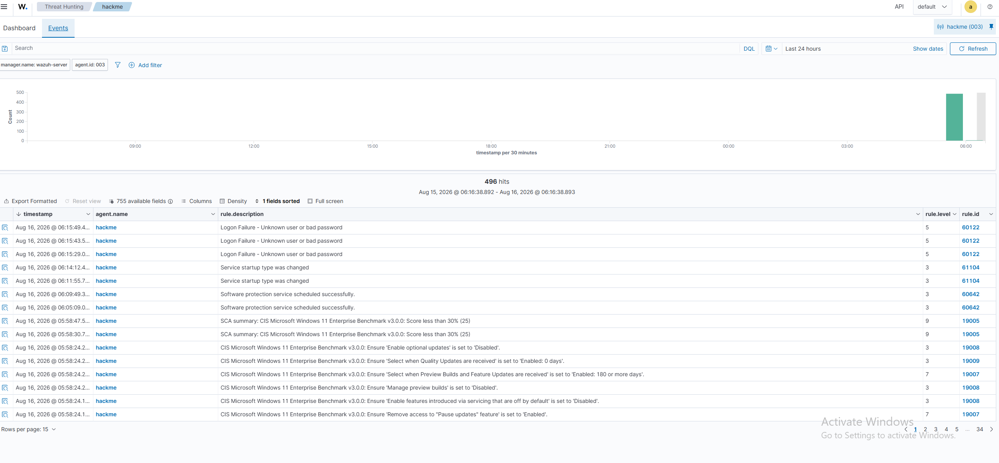
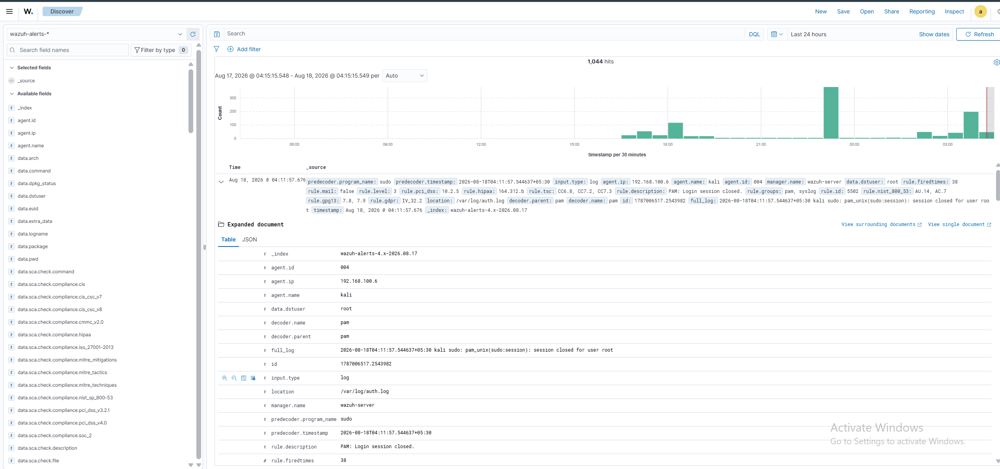
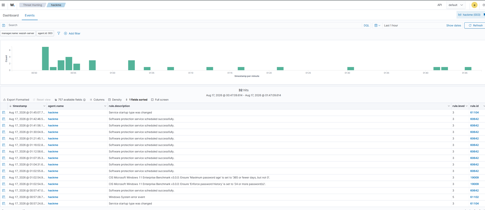
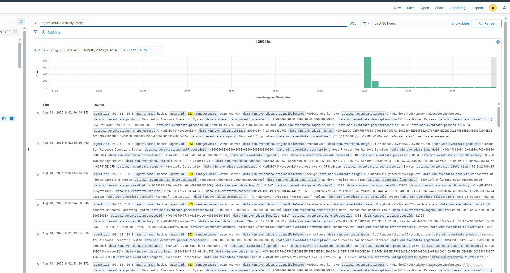

# Detection Rules

This document explains how Wazuh detects malicious activities using built-in detection rules and custom rules within the SOC Home Lab.

---

# Table of Contents

- Overview
- Wazuh Detection Engine
- Alert Levels
- Built-in Rules
- Attack Detection
- Custom Rules
- Rule Testing
- Dashboard Analysis
- MITRE ATT&CK Mapping
- Troubleshooting
- Conclusion

---

# Overview

The Wazuh detection engine continuously analyzes security events received from monitored endpoints.

Events are compared against predefined detection rules to identify suspicious or malicious activities.

When a rule matches an event, Wazuh generates an alert with a severity level and additional metadata.

---

# Detection Workflow

```
Attack

↓

Windows Event Logs

↓

Sysmon

↓

Wazuh Agent

↓

Wazuh Manager

↓

Decoder

↓

Detection Rules

↓

Alert

↓

Dashboard
```

---

# Wazuh Detection Components

## Decoders

Decoders extract useful information from incoming logs.

Example

```
Windows Event Log

↓

Decoder

↓

Event Fields
```

Example extracted fields

- Event ID
- Username
- Source IP
- Process Name
- Command Line
- Parent Process

---

## Rules

Rules compare decoded events against known attack patterns.

Example

```
Event ID = 4625

↓

Failed Login Rule

↓

Generate Alert
```

---

# Alert Levels

| Level | Description |
|---------|-------------|
| 0 | Ignored |
| 1–3 | Informational |
| 4–6 | Low |
| 7–9 | Medium |
| 10–12 | High |
| 13–15 | Critical |

Higher alert levels indicate greater severity.

---

# Built-in Detection Rules

The lab primarily relies on Wazuh's built-in detection rules.

Examples include:

- Failed Logon Detection
- Successful Logon Detection
- PowerShell Execution
- Sysmon Process Creation
- Registry Modification
- Service Installation
- Network Connections
- Account Lockout
- Windows Defender Events

---

# Attack Detection Examples

## 1. Failed Login

Windows Event ID

```
4625
```

Detection

- Invalid credentials
- Possible brute-force attempt

Alert Level

```
High
```

---

## 2. Successful Login

Windows Event ID

```
4624
```

Purpose

Track user authentication.

---

## 3. Process Creation

Sysmon Event ID

```
1
```

Examples

- cmd.exe
- powershell.exe
- reg.exe
- net.exe

---

## 4. Network Connection

Sysmon Event ID

```
3
```

Purpose

Monitor outbound connections.

---

## 5. Registry Modification

Sysmon Event ID

```
13
```

Detects

- Registry persistence
- Malware behavior

---

## 6. DNS Queries

Sysmon Event ID

```
22
```

Purpose

Track domain lookups.

---

# Custom Rules

Wazuh allows administrators to create custom detection rules.

Location

```
/var/ossec/etc/rules/local_rules.xml
```

Example

```xml
<group name="custom_rules">

  <rule id="100001" level="10">

    <if_sid>18107</if_sid>

    <description>Custom PowerShell Detection</description>

  </rule>

</group>
```

Restart the manager

```bash
sudo systemctl restart wazuh-manager
```

---

# Testing Rules

Generate test events.

Examples

- Failed Login
- Nmap Scan
- PowerShell Execution
- Registry Change

Verify alerts appear in

```
Dashboard

↓

Threat Hunting

↓

Security Events
```

---

# Dashboard Analysis

For each alert verify

- Rule ID
- Alert Level
- Agent Name
- Source IP
- Event Time
- MITRE Technique
- Full Log

---

# Example Alert

```
Rule ID

18107

Level

10

Description

PowerShell execution detected

Agent

Windows11

Technique

T1059
```

---

# MITRE ATT&CK Mapping

| Activity | Technique |
|-----------|-----------|
| PowerShell | T1059 |
| Network Discovery | T1016 |
| Port Scan | T1046 |
| Brute Force | T1110 |
| Registry Modification | T1112 |
| Command Execution | T1059 |
| Process Injection | T1055 |

---

# Verification Checklist

- Rules Loaded

- Alerts Generated

- Dashboard Updated

- Rule IDs Visible

- Alert Levels Correct

- MITRE Mapping Available

---

# Screenshots

### 1. Windows Failed Logon Detection (Rule 18152)

*Wazuh Security Alert for Windows authentication failure matching Event ID 4625.*

---

### 2. Linux PAM Authentication Rule Match (Rule 5502)

*Wazuh Alert triggered on Linux authentication log `/var/log/auth.log` for root session events.*

---

### 3. Threat Hunting Event Table with Rule Breakdown

*Real-time rule matches displaying Rule IDs, descriptions, severity levels, and CIS compliance mappings.*

---

### 4. Process Creation & Telemetry Ingestion

*Sysmon endpoint event ingestion correlated with process metadata.*

---

# Best Practices

- Use Sysmon for detailed Windows telemetry.
- Keep Wazuh rules updated.
- Review high-severity alerts first.
- Tune rules to reduce false positives.
- Test custom rules in a lab before production deployment.

---

# Conclusion

The Wazuh detection engine successfully identified attack activities generated during this project using built-in and custom detection rules. The combination of Windows Event Logs, Sysmon telemetry, and Wazuh's rule engine provides effective detection and centralized security monitoring.