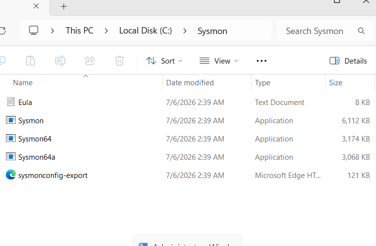
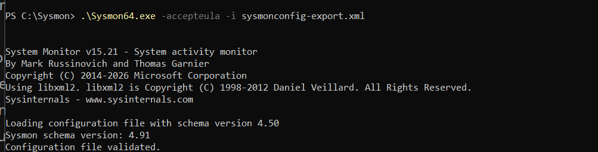
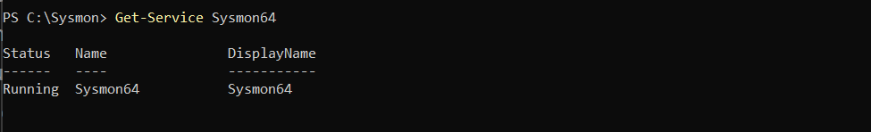
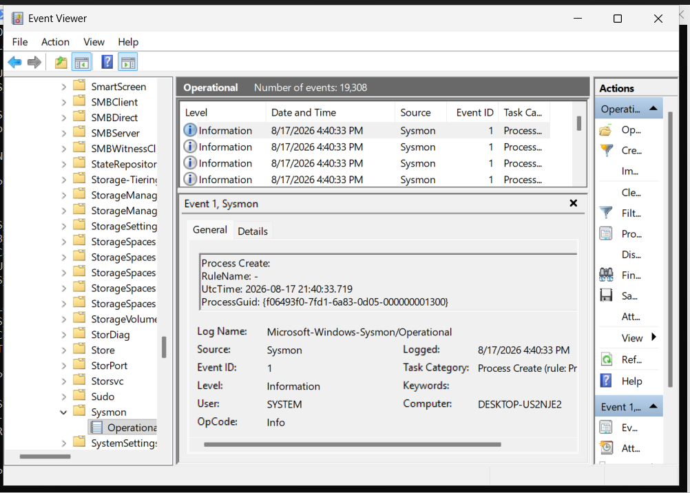
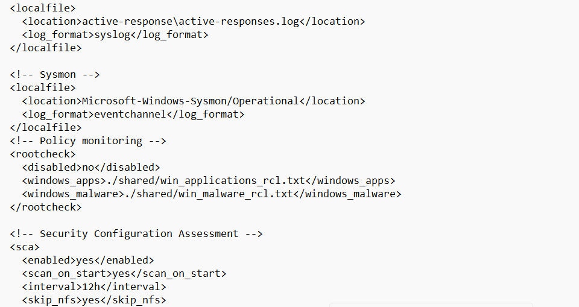
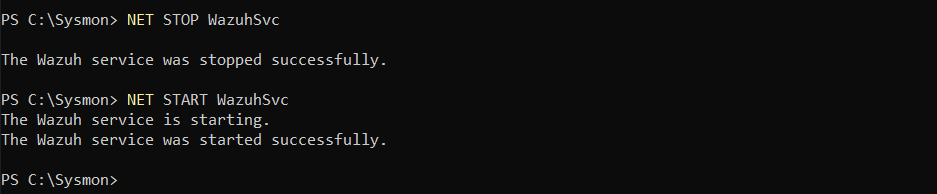
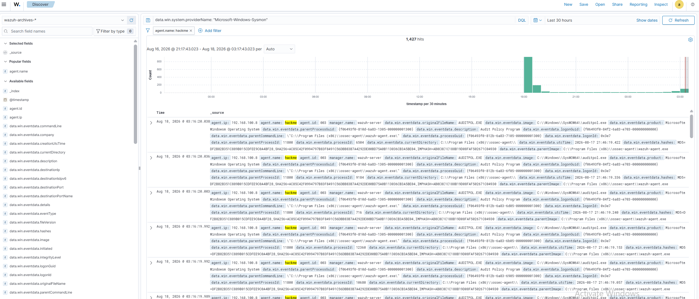

# Sysmon Configuration

This document describes how Microsoft Sysmon was installed and configured on the Windows 11 endpoint to provide detailed telemetry for the Wazuh SIEM platform.

---

# Table of Contents

- Introduction
- Why Sysmon?
- Prerequisites
- Download Sysmon
- Install Sysmon
- Verify Installation
- Configure Wazuh
- Event IDs Collected
- Verification
- Troubleshooting
- Screenshots

---

# Introduction

System Monitor (Sysmon) is a Windows system service from the Microsoft Sysinternals Suite that records detailed information about system activity.

Unlike the default Windows Event Logs, Sysmon provides rich telemetry including:

- Process Creation
- Network Connections
- File Creation
- Registry Changes
- Driver Loading
- PowerShell Activity
- Image Loading
- Process Injection Detection

These logs are forwarded to Wazuh for analysis and alert generation.

---

# Why Sysmon?

Default Windows logs provide limited visibility.

Sysmon greatly enhances endpoint monitoring by recording detailed events that are useful for:

- Threat Hunting
- Malware Detection
- Digital Forensics
- Incident Response
- SOC Monitoring

---

# Prerequisites

Before installing Sysmon:

- Windows 11 Pro
- Wazuh Agent Installed
- Administrator Privileges

---

# Download Sysmon

Download Sysmon from the official Microsoft Sysinternals website.

The package contains:

```
Sysmon.exe
Sysmon64.exe
```

Extract the archive.

---

# Download Sysmon Configuration

A configuration XML file is required.

Example

```
sysmonconfig.xml
```

Place the configuration file in a working directory.

---

# Install Sysmon

Open **PowerShell as Administrator**.

Navigate to the Sysmon directory.

Example

```powershell
cd C:\Tools\Sysmon
```

Install Sysmon.

```powershell
Sysmon64.exe -accepteula -i sysmonconfig.xml
```

Expected Output

```
System Monitor installed.

Service started successfully.
```

---

# Verify Installation

Check the service.

```powershell
Get-Service Sysmon64
```

Expected

```
Running
```

---

# Verify Event Logs

Open Event Viewer.

Navigate to

```
Applications and Services Logs

Microsoft

Windows

Sysmon

Operational
```

Verify events are being generated.

---

# Configure Wazuh

The Wazuh Agent automatically collects Sysmon events when the appropriate event channel is enabled.

Verify the Wazuh agent configuration includes the Sysmon Operational log.

Example

```xml
<localfile>
    <location>Microsoft-Windows-Sysmon/Operational</location>
    <log_format>eventchannel</log_format>
</localfile>
```

Restart the Wazuh Agent after making changes.

```powershell
NET STOP WazuhSvc
NET START WazuhSvc
```

---

# Important Sysmon Event IDs

| Event ID | Description |
|-----------|-------------|
| 1 | Process Creation |
| 2 | File Creation Time Changed |
| 3 | Network Connection |
| 5 | Process Terminated |
| 7 | Image Loaded |
| 8 | Create Remote Thread |
| 10 | Process Access |
| 11 | File Created |
| 12 | Registry Object Created |
| 13 | Registry Value Set |
| 22 | DNS Query |

---

# Testing Sysmon

Open Command Prompt.

Run

```cmd
ipconfig
```

Open PowerShell.

Run

```powershell
Get-Process
```

Open Notepad.

Launch Command Prompt.

Generate several processes.

These actions should generate Sysmon events.

---

# Verify in Wazuh Dashboard

Open

```
https://<SERVER-IP>
```

Navigate to

```
Security Events
```

Search

```
Sysmon
```

You should observe events such as:

- Process Creation
- Network Connections
- Registry Changes

---

# Troubleshooting

## No Sysmon Events

Check

```powershell
Get-Service Sysmon64
```

---

## Service Not Running

Restart

```powershell
Sysmon64.exe -c
```

or reinstall

```powershell
Sysmon64.exe -i sysmonconfig.xml
```

---

## Wazuh Not Receiving Logs

Restart the Wazuh Agent.

```powershell
NET STOP WazuhSvc
NET START WazuhSvc
```

Verify

```
Microsoft-Windows-Sysmon/Operational
```

is enabled in the Wazuh configuration.

---

# Verification Checklist

- Sysmon Installed
- Service Running
- Configuration Loaded
- Event Viewer Recording Events
- Wazuh Receiving Sysmon Logs
- Dashboard Showing Events

---

# Screenshots

The following screenshots demonstrate the complete Sysmon deployment, configuration, local telemetry verification, and Wazuh SIEM ingestion:

### 1. Sysmon Download & Directory Setup

*Sysmon binaries (`Sysmon64.exe`) and configuration XML placed in `C:\Sysmon`.*

---

### 2. Sysmon Installation via PowerShell

*Executing `Sysmon64.exe -accepteula -i sysmonconfig-export.xml` with schema validation.*

---

### 3. Sysmon Service Status

*Verifying `Sysmon64` service is active and in `Running` status.*

---

### 4. Windows Event Viewer (Sysmon Operational Logs)

*Local Event Viewer showing `Microsoft-Windows-Sysmon/Operational` telemetry (Event ID 1: Process Create).*

---

### 5. Wazuh Agent `ossec.conf` Sysmon Channel Integration

*Configuring `<location>Microsoft-Windows-Sysmon/Operational</location>` with `eventchannel` format.*

---

### 6. Wazuh Agent Service Restart

*Restarting the `WazuhSvc` service to apply new log ingestion channels.*

---

### 7. Wazuh Dashboard / Discover — Live Sysmon Ingestion

*Wazuh Discover interface displaying over 1,400+ captured Sysmon events forwarded from the Windows 11 endpoint (`hackme` / `003`).*

---

# Conclusion

Sysmon significantly enhances Windows endpoint visibility by generating detailed security telemetry. Integrated with Wazuh, it enables effective monitoring, threat detection, and forensic analysis in the SOC Home Lab.
