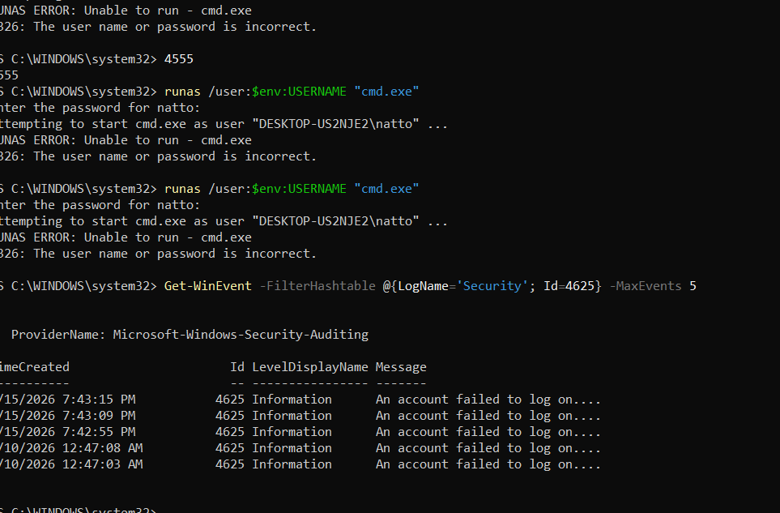
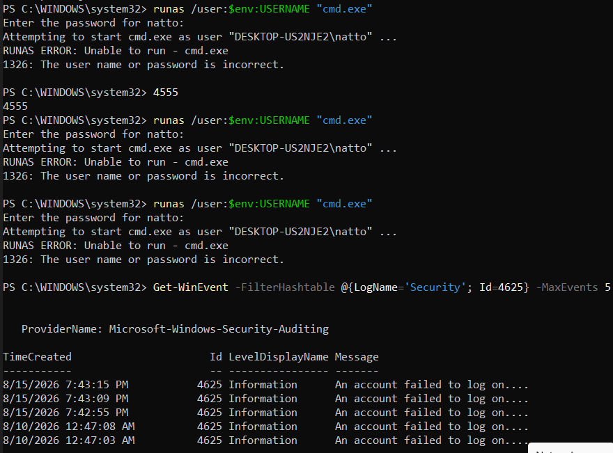
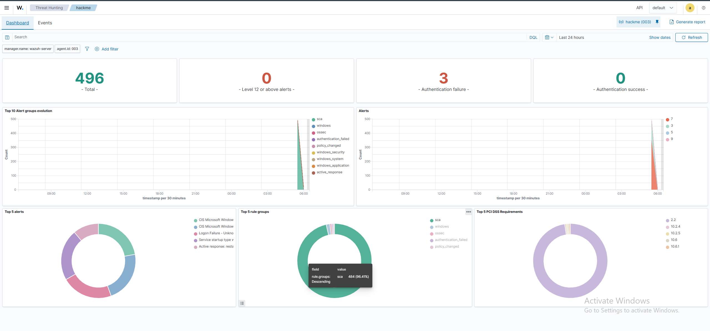

# Windows 11 Wazuh Agent Installation

This document explains how the Wazuh Agent was installed and configured on the Windows 11 endpoint used in this SOC Home Lab.

---

# Table of Contents

- Overview
- Lab Information
- Prerequisites
- Verify Connectivity
- Download the Agent
- Install the Agent
- Start the Agent
- Verify the Service
- Verify Agent Registration
- Dashboard Verification
- Test Event Collection
- Common Commands
- Troubleshooting
- Verification Checklist
- Screenshots
- Conclusion

---

# Overview

The Windows endpoint is the primary monitored system in this project. It generates security events that are forwarded to the Wazuh Server for analysis.

The endpoint collects:

- Windows Security Logs
- PowerShell Events
- Process Creation Events
- Service Installation
- Registry Changes
- File Integrity Events
- Sysmon Logs

---

# Lab Information

| Component | Value |
|-----------|-------|
| Operating System | Windows 11 Pro |
| Agent | Wazuh Agent |
| Server | Ubuntu Server 24.04 |
| SIEM | Wazuh |

---

# Prerequisites

Before installing the agent:

- Wazuh Server installed
- Wazuh Manager running
- Windows can reach the server
- Firewall allows communication

---

# Verify Connectivity

Open Command Prompt.

```cmd
ping <WAZUH_SERVER_IP>
```

Example

```cmd
ping 10.0.2.15
```

Expected Result

```
Reply from 10.0.2.15
```

---

# Download the Agent

Download the Windows Wazuh Agent from the official Wazuh website.

Run the installer as **Administrator**.

---

# Install the Agent

During installation provide:

Manager Address

```
<Server IP>
```

Example

```
10.0.2.15
```

Agent Name

```
Windows11
```

Agent Group

```
Default
```

Complete the installation.

---

# Start the Agent

Open PowerShell as Administrator.

```powershell
NET START WazuhSvc
```

---

# Verify the Service

```powershell
Get-Service WazuhSvc
```

Expected

```
Running
```

---

# Verify Agent Registration

On Ubuntu Server:

```bash
sudo /var/ossec/bin/agent_control -l
```

Example

```
ID:001

Name:Windows11

Status:Active
```

---

# Dashboard Verification

Open

```
https://<SERVER-IP>
```

Navigate to

```
Agents
```

Verify

- Windows11
- Active
- Last Keep Alive updated

---

# Test Event Collection

Generate a failed Windows login.

Open the Wazuh Dashboard.

Navigate to

```
Security Events
```

Confirm the event appears.

---

# Common Commands

Restart Agent

```powershell
NET STOP WazuhSvc
NET START WazuhSvc
```

Check Service

```powershell
Get-Service WazuhSvc
```

---

# Troubleshooting

## Agent Offline

Verify

- Service running
- Correct manager IP
- Windows Firewall
- Network connectivity

---

## Manager Not Receiving Logs

Restart the service

```powershell
NET STOP WazuhSvc
NET START WazuhSvc
```

Check

```
C:\Program Files (x86)\ossec-agent\
```

---

# Verification Checklist

- Windows Installed
- Agent Installed
- Service Running
- Agent Registered
- Dashboard Connected
- Events Received

---

# Screenshots

### 1. Windows 11 Endpoint Desktop & Connectivity

*Windows 11 virtual machine desktop environment.*


*ICMP ping test verifying network reachability to the Wazuh Manager.*

---

### 2. Wazuh Agent Download & Deployment

*Downloading the Windows MSI agent package.*


*Executing agent deployment command with manager registration parameters.*

---

### 3. Agent Installation & Service Status

*Wazuh Agent installation process completing on the Windows 11 host.*


*Windows Services console (`services.msc`) showing `WazuhSvc` in `Running` state.*

---

### 4. Manager Registration & Active Dashboard

*Wazuh Manager acknowledging agent registration with assigned Agent ID `003`.*


*Wazuh Dashboard Active Agents summary showing Windows 11 endpoint actively reporting.*

---

### 5. Security Telemetry & Failed Logon Detection

*Simulating failed logon attempts on the Windows endpoint.*


*Windows Event Viewer recording Event ID 4625 (Failed Logon).*


*Wazuh Dashboard Security Events overview displaying ingested telemetry.*


*Wazuh Alert triggered for Windows logon failure (Rule 18152 / Event 4625).*

---

# Conclusion

The Windows endpoint successfully forwards security events to the Wazuh Server, allowing centralized monitoring, alert generation, and incident analysis within the SOC Home Lab.
