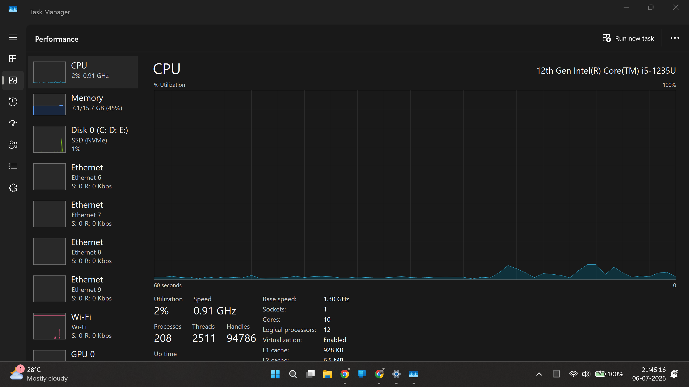
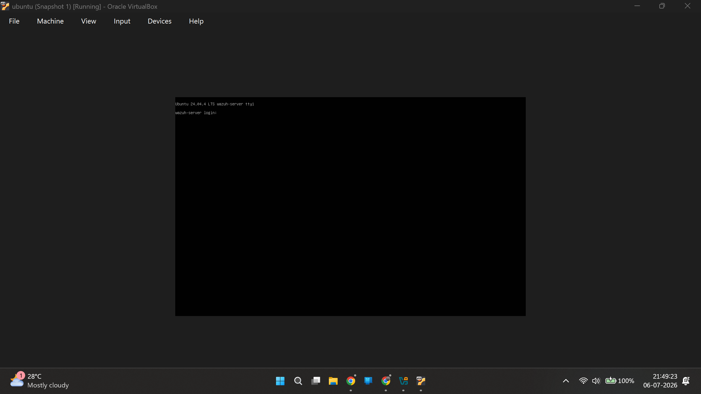
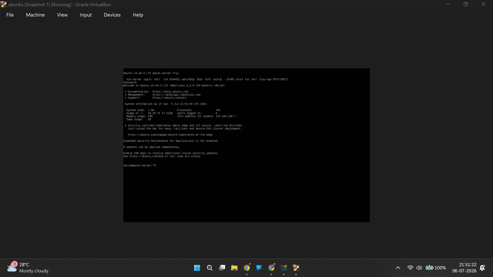
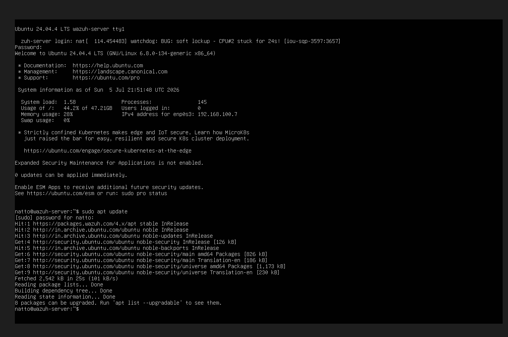
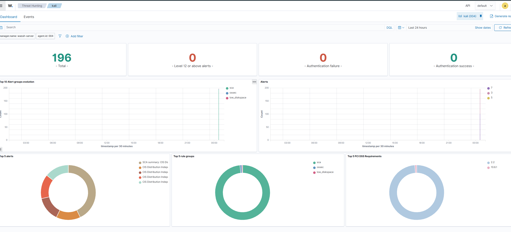
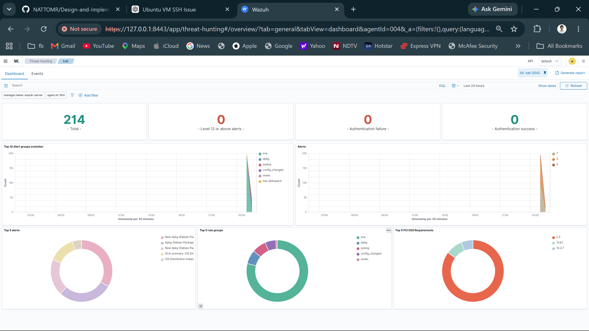

```screenshots/
│
├── 01-host-machine.png
├── 02-virtualbox-home.png
├── 03-nat-network-settings.png
│
├── 04-ubuntu-installation.png
├── 05-ubuntu-login.png
├── 06-system-update.png
├── 07-wazuh-installation.png
├── 08-wazuh-installation-complete.png
├── 09-wazuh-manager-status.png
├── 10-wazuh-indexer-status.png
├── 11-wazuh-dashboard-status.png
├── 12-wazuh-dashboard-login.png
├── 13-wazuh-dashboard-home.png
│
├── 14-windows11-desktop.png
├── 15-windows-agent-installer.png
├── 16-windows-agent-installation.png
├── 17-wazuh-agent-service.png
├── 18-agent-registered.png
├── 18a-agent-pending.png
├── 19-active-agents.png
├── 19a-failed-logon-test.png
├── 19b-failed-logon-events.png
├── 19c-dashboard-events-overview.png
├── 19d-dashboard-failed-logon.png
├── 20-kali-agent-threat-hunting.png
├── 21-kali-agent-log-telemetry.png
├── 22-agent-threat-hunting-events.png
├── Screenshot 2026-08-17 010853.png
├── Screenshot 2026-08-17 012801.png
├── Screenshot 2026-08-17 014722.png
│
├── 20-sysmon-download.png
├── 21-sysmon-installation.png
├── 22-sysmon-service.png
├── 23-event-viewer-sysmon.png
├── 24-sysmon-events-dashboard.png
│
├── 25-kali-desktop.png
├── 26-kali-ip-address.png
├── 27-ping-windows.png
├── 28-ping-wazuh-server.png
├── 29-nmap-host-discovery.png
├── 30-nmap-port-scan.png
├── 31-nmap-service-scan.png
├── 32-nmap-os-detection.png
├── 33-nmap-aggressive-scan.png
│
├── 34-security-events.png
├── 35-alert-details.png
├── 36-rule-information.png
├── 37-mitre-attck-mapping.png
├── 38-dashboard-threat-hunting.png
├── 39-dashboard-overview.png
│
├── 40-ossec-conf.png
├── 41-local-rules.png
├── 42-local-decoder.png
├── 43-sysmon-config.png
│
├── 44-filebeat-status.png
├── 45-systemctl-services.png
├── 46-agent-control-list.png
│
├── 47-final-dashboard.png
├── 48-project-architecture.png
└── 49-final-alert.png

```

```
## Host Machine



---

## VirtualBox Home


---

## NAT Network Settings


---

## Ubuntu Installation



---

## Ubuntu Login



---

## System Update



---

## Wazuh Installation


---

## Wazuh Installation Complete


---

## Wazuh Manager Status


---

## Wazuh Indexer Status


---

## Wazuh Dashboard Status


---

## Wazuh Dashboard Login


---

## Wazuh Dashboard Home


---

## Windows 11 Desktop


---

## Wazuh Agent Installer


---

## Windows Agent Installation


---

## Wazuh Agent Service


---

## Agent Registered


---

## Active Agents


---

## Kali Linux Agent (004) — Threat Hunting Overview


*Initial telemetry and SCA metrics ingested into Wazuh Dashboard for Kali Linux agent (`hacker01` / `004`).*

---

## Kali Linux Agent (004) — Comprehensive Log Telemetry & Rule Groups


*Multi-source log ingestion (dpkg, syslog, config_changed, sca, ossec) showing 214 security events captured for the Kali agent.*

---

## Agent Threat Hunting Events Detail View


*Real-time Threat Hunting event table showing rule descriptions, rule IDs (61104, 60642, 19009, 61102), severity levels, and CIS benchmarks.*

---

## Sysmon Download


---

## Sysmon Installation


---

## Sysmon Service


---

## Event Viewer - Sysmon


---

## Sysmon Events Dashboard


---

## Kali Desktop


---

## Kali IP Address


---

## Ping Windows


---

## Ping Wazuh Server


---

## Nmap Host Discovery


---

## Nmap Port Scan


---

## Nmap Service Scan


---

## Nmap OS Detection


---

## Nmap Aggressive Scan


---

## Security Events


---

## Alert Details


---

## Rule Information


---

## MITRE ATT&CK Mapping


---

## Dashboard Threat Hunting


---

## Dashboard Overview


---

## ossec.conf


---

## Local Rules


---

## Local Decoder


---

## Sysmon Configuration


---

## Filebeat Status


---

## Systemctl Services


---

## Agent Control List


---

## Final Dashboard


---

## Project Architecture


---

## Final Alert


```

```
| Document                      | Screenshot Numbers     |
| ----------------------------- | ---------------------- |
| **README.md**                 | 13, 19, 39, 47, 48, 49 |
| **Architecture.md**           | 2, 3, 48               |
| **Wazuh-Installation.md**     | 4–13                   |
| **Windows11-Agent.md**        | 14–19                  |
| **Sysmon-Configuration.md**   | 20–24                  |
| **Kali-Attack-Simulation.md** | 25–39                  |
| **Detection-Rules.md**        | 34–39, 49              |
| **Troubleshooting.md**        | 45–46                  |


```
