# Wazuh Installation Guide

This document describes the complete installation and configuration process of the Wazuh Security Information and Event Management (SIEM) platform used in this project.

---

# Table of Contents

- Prerequisites
- Lab Environment
- Network Configuration
- Installing Ubuntu Server
- Updating the System
- Installing Wazuh
- Accessing the Dashboard
- Verifying Services
- Installing the Windows Agent
- Registering the Agent
- Troubleshooting
- References

---

# Prerequisites

Before starting the installation, ensure the following requirements are met.

## Host Machine

| Component | Specification |
|-----------|--------------|
| Operating System | Windows 11 Pro |
| Hypervisor | Oracle VirtualBox |
| RAM | 16 GB |
| Storage | 100+ GB Free |

---

# Virtual Machines

| Machine | Purpose |
|----------|---------|
| Ubuntu Server 24.04 LTS | Wazuh Server |
| Windows 11 Pro | Endpoint |
| Kali Linux | Attacker |

---

# Network Configuration

VirtualBox Network Mode

```
NAT Network
```

Example IP Addressing

| Machine | Example IP |
|----------|------------|
| Ubuntu Server | 10.0.2.15 |
| Windows 11 | 10.0.2.20 |
| Kali Linux | 10.0.2.30 |

> **Note:** Your IP addresses may differ. Use `ip a` on Linux or `ipconfig` on Windows to check them.

---

# Installing Ubuntu Server

1. Download Ubuntu Server 24.04 LTS ISO.
2. Create a new VirtualBox virtual machine.
3. Allocate:
   - 4 GB RAM (minimum)
   - 2–4 CPU cores
   - 50 GB dynamically allocated disk
4. Install Ubuntu Server.
5. Create a user account.
6. Enable OpenSSH during installation.

---

# Update the System

Run:

```bash
sudo apt update
sudo apt upgrade -y
```

Reboot if necessary:

```bash
sudo reboot
```

---

# Download the Wazuh Installer

```bash
curl -sO https://packages.wazuh.com/4.14/wazuh-install.sh
```

Make the script executable:

```bash
chmod +x wazuh-install.sh
```

---

# Install Wazuh

Install the all-in-one deployment:

```bash
sudo ./wazuh-install.sh -a
```

> **Note:** If the installer reports insufficient resources in a lab environment, you can use the option to ignore hardware checks if appropriate for testing.

The installer automatically deploys:

- Wazuh Manager
- Wazuh Indexer
- Wazuh Dashboard

---

# Installation Output

After successful installation, the installer displays:

- Dashboard URL
- Username
- Password

Save these credentials securely.

Example:

```
URL:
https://<SERVER-IP>

Username:
admin

Password:
********
```

---

# Verify Services

Check Wazuh Manager:

```bash
sudo systemctl status wazuh-manager
```

Check Wazuh Indexer:

```bash
sudo systemctl status wazuh-indexer
```

Check Wazuh Dashboard:

```bash
sudo systemctl status wazuh-dashboard
```

All services should display:

```
Active: active (running)
```

---

# Access the Dashboard

Open a web browser.

```
https://<SERVER-IP>
```

Example

```
https://10.0.2.15
```

Login using the administrator credentials generated during installation.

---

# Install the Windows Agent

Download the Windows Wazuh Agent from the official Wazuh website.

Run the installer as Administrator.

During installation provide:

```
Manager Address:
<Ubuntu Server IP>

Agent Name:
Windows11

Registration Password:
(Optional if configured)
```

Complete the installation.

---

# Start the Agent

Open PowerShell as Administrator.

```powershell
NET START WazuhSvc
```

Verify the service:

```powershell
Get-Service WazuhSvc
```

Expected status:

```
Running
```

---

# Verify Agent Registration

On the Ubuntu Server:

```bash
sudo /var/ossec/bin/agent_control -l
```

Example output:

```
ID: 000
Name: wazuh-server

ID: 001
Name: Windows11
Status: Active
```

---

# Test Connectivity

Ping the server from Windows:

```cmd
ping <SERVER-IP>
```

Example:

```cmd
ping 10.0.2.15
```

---

# Test Event Collection

Generate a failed login attempt or another test event on the Windows machine.

Verify that the event appears in the Wazuh Dashboard under:

```
Security Events
```

---

# Troubleshooting

## Dashboard does not load

Check:

```bash
sudo systemctl status wazuh-dashboard
```

---

## Manager is not running

Restart:

```bash
sudo systemctl restart wazuh-manager
```

---

## Indexer is not running

Restart:

```bash
sudo systemctl restart wazuh-indexer
```

---

## Agent not connected

Restart the Windows Agent:

```powershell
NET STOP WazuhSvc
NET START WazuhSvc
```

Check the firewall configuration and verify the manager IP address in the agent configuration.

---

# Verification Checklist

- Ubuntu Server installed
- System updated
- Wazuh Manager running
- Wazuh Dashboard accessible
- Wazuh Indexer running
- Windows Agent connected
- Events visible in Dashboard

---

# Screenshots

The following screenshots demonstrate the successful installation and configuration of the Wazuh Server:

### Wazuh Installation & Version
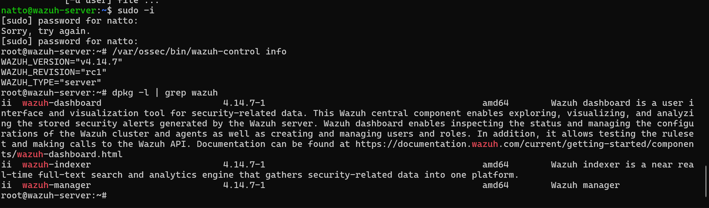

### Wazuh Installation Complete
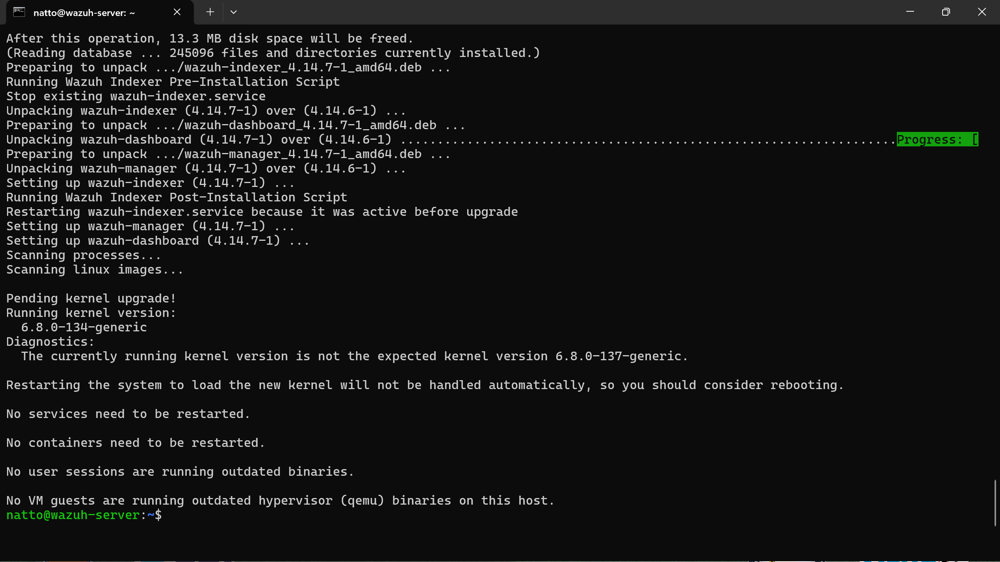

### Wazuh Manager Status
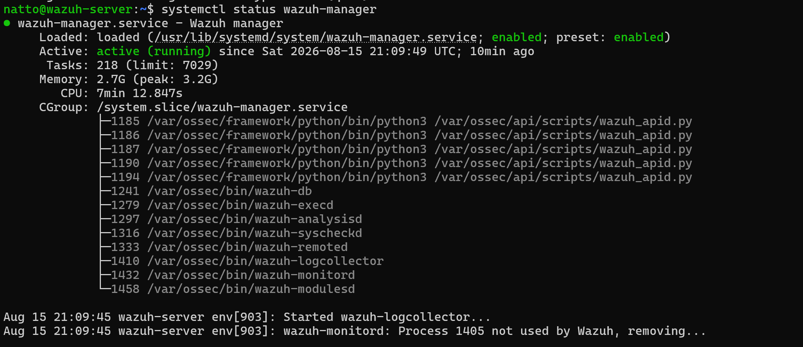

### Wazuh Indexer Status
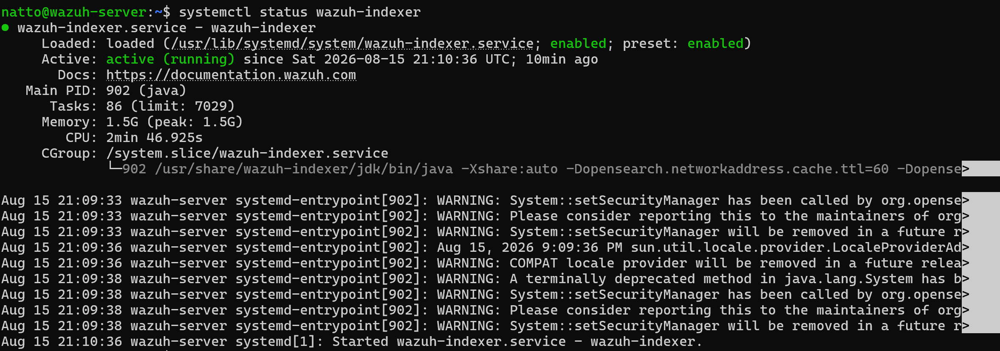

### Wazuh Dashboard Status
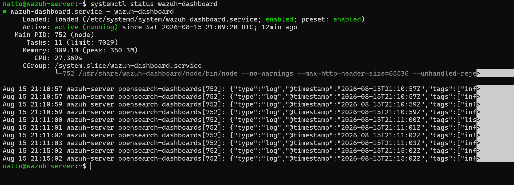

### Wazuh Dashboard Login


### Wazuh Dashboard Overview
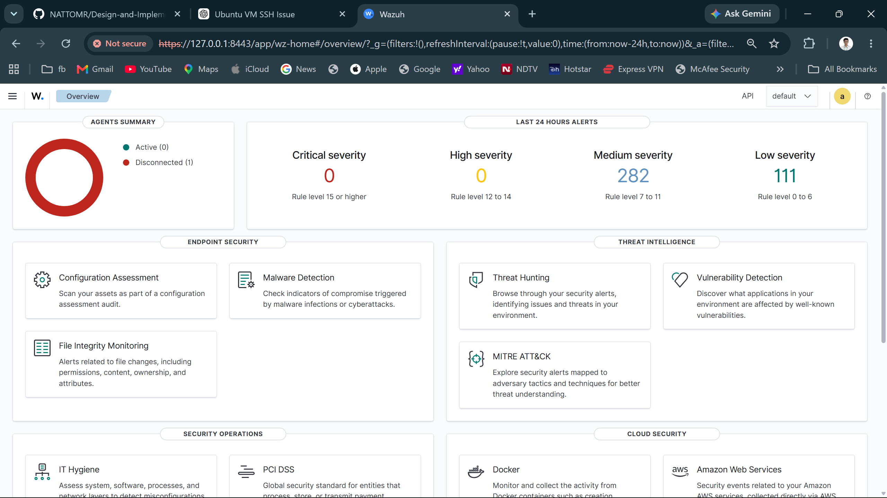

*(Windows Agent and further screenshots will be added below once captured)*

---

### Windows 11 Connectivity (Ping Test)
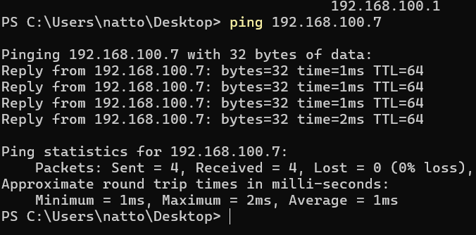

### Windows 11 Desktop


### Windows Agent Deployment Configuration
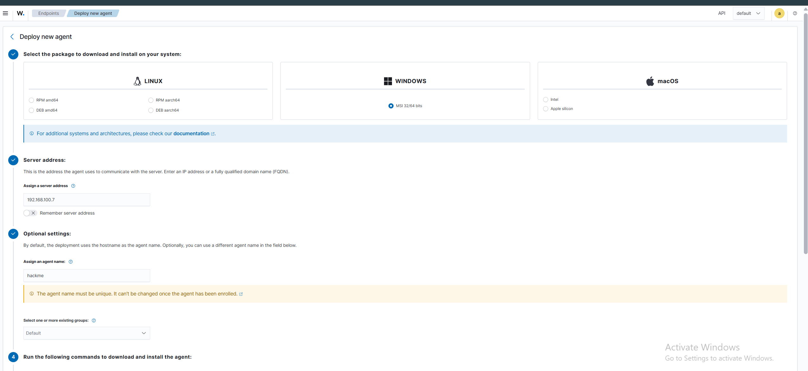

### Windows Agent Download
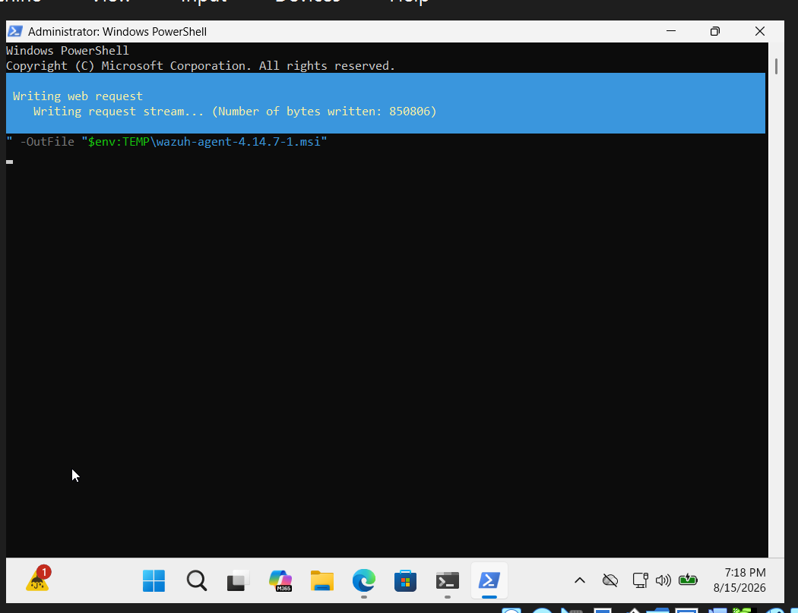

### Windows Agent Installation
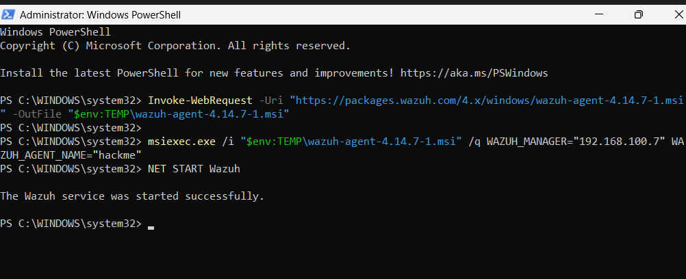

### Windows Agent Service Running
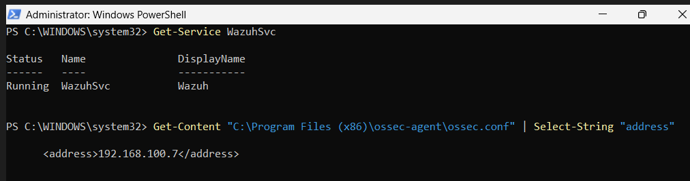

### Agent Registered
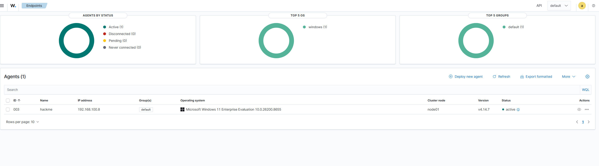

### Active Windows Agent
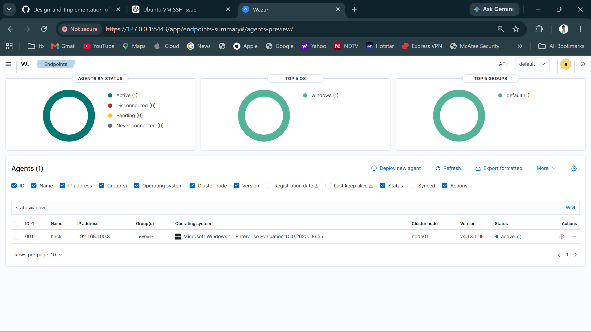

---

# References

- Wazuh Official Documentation
- Ubuntu Server Documentation
- Oracle VirtualBox Documentation

---

**Author:** Natto Muni Chakma

**Project:** Design and Implementation of a Wazuh-Based SOC Home Lab for Attack Detection and Log Analysis